# Key Points to Review

[Stats](#stats)
[Geometry](#geometry)
[xy plane](#xy-plane)
[number properties](#number-properties)

### Need to study more
probability?
study SIN COS TAN and traingle short cuts 
均值不等式 
二项式定理
if twice as many employees work at the plant in Mexico as work at the plant in Pakistan Means 2 Pakis = Mexico

### Combination 
Ex: 8 pick 4 when order don't matter
8C4 = 8!/(8-4)!4! = 8*7*6*5/4*3*2*1 = 70

### Permutation
Ex: 8 pick 4 when order does matter
if repeats are not allowed:
8P4 = 8! / (8-4)! 
if there is repeat
8^4

### Stats 
### Normal Curve
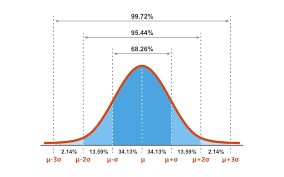
Area between 1 sd = 68 / 34.13% each
Area between 2 sd = 95 / 13.59% each
Area between 3 sd = 99 / 2.14% each

### skewed to the left or right: mean VS median
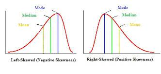
skew to the right: mean > median
skew to the left: mean < median

### boxplot
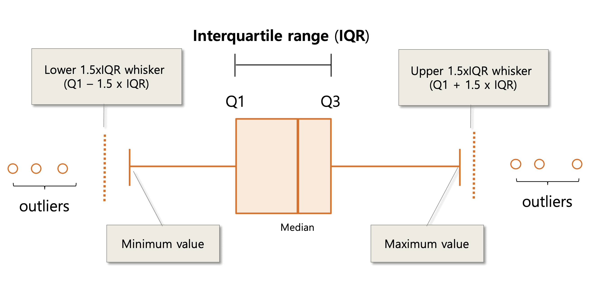
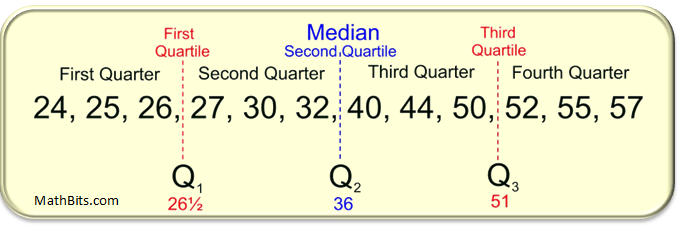

## Geometry
### Triangles
### Congruent Triangles
SSS, SAS, ASA, AAS
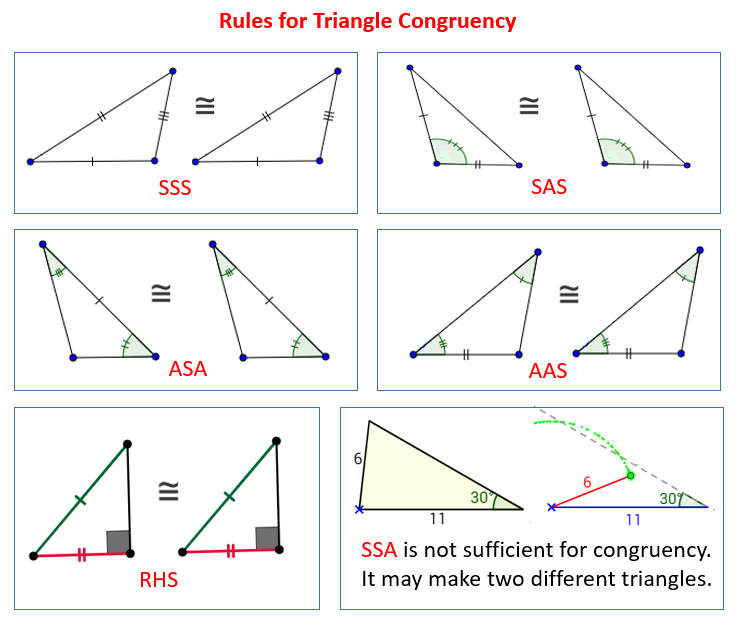

### Propery of Isosceles, Equilateral

### equilateral triangle area formula
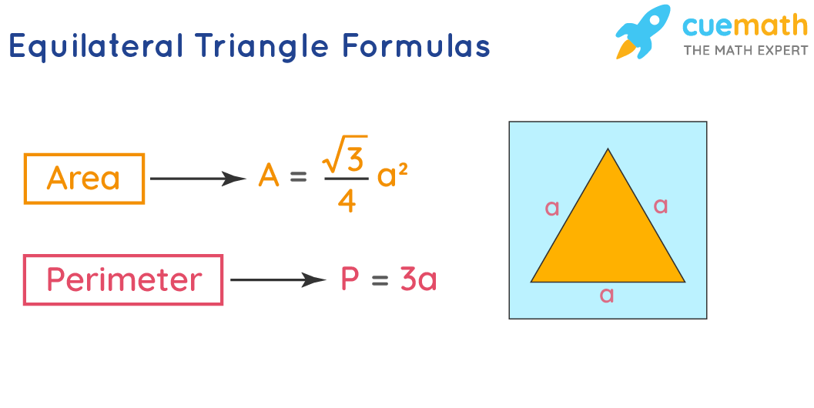

- radical 3 / 4 * (a^2) 
- a is the side length

多边形内角和公式=(n-2)*180

三角形：外角=两个内角和
两边之和大于第三边， 两边之差小于第三边。
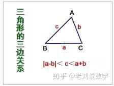

### Rhombus
rhombus's 4 sides are equal.
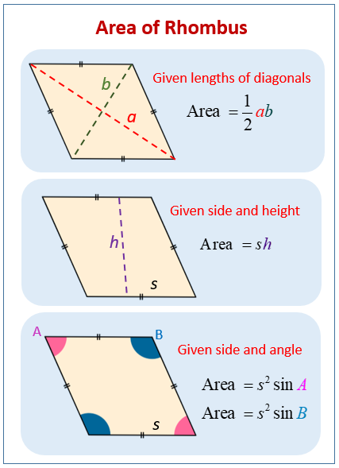

study rhombus's area equation 
- given side and hieight, area = side * height
- given d1 and d2 which are directly across inside it, area = 1/2 * a * b
- given side and angles, area = s^2 sin angle

### 同圆或等圆中，同弧或等弧所对的圆周角相等
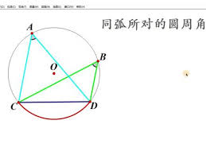

### circular cone equation

### n边形对角线数量公式
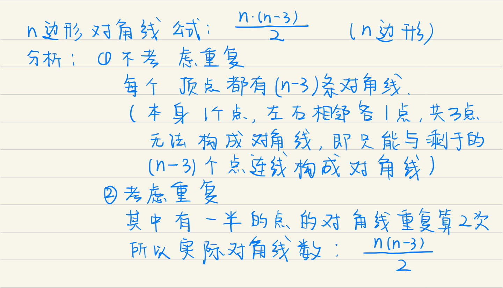

## XY-Plane
### formula for the difference of square  

(a+b)^2 = a^2 + 2ab + b^2 and (a-b)^2 = a^2 - 2ab+b^2

### distance formula
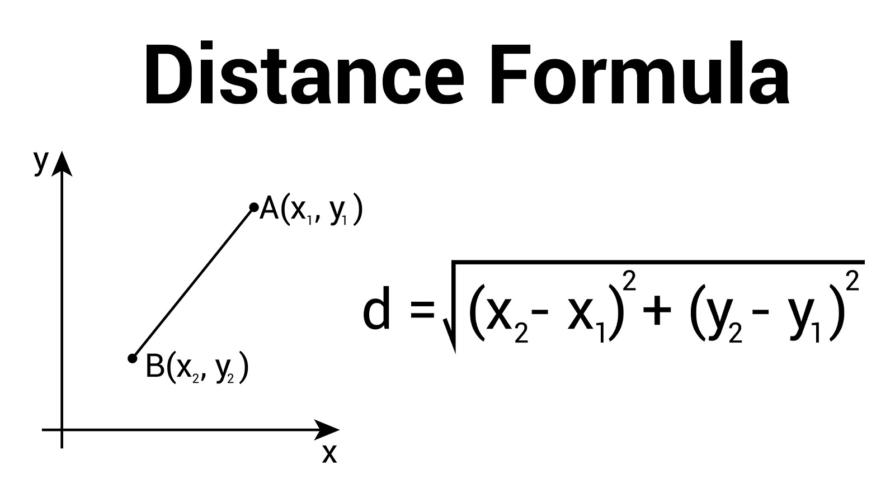

### 4 qraduents
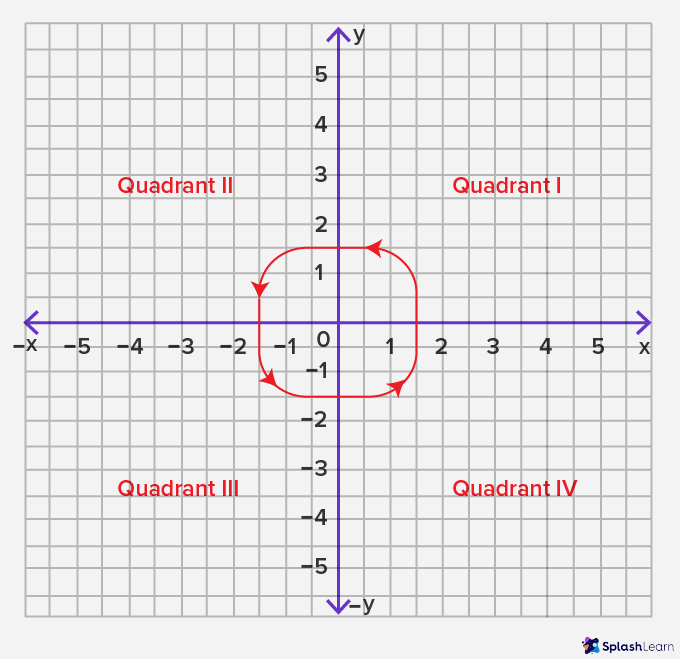

### find midpoint of 2 points
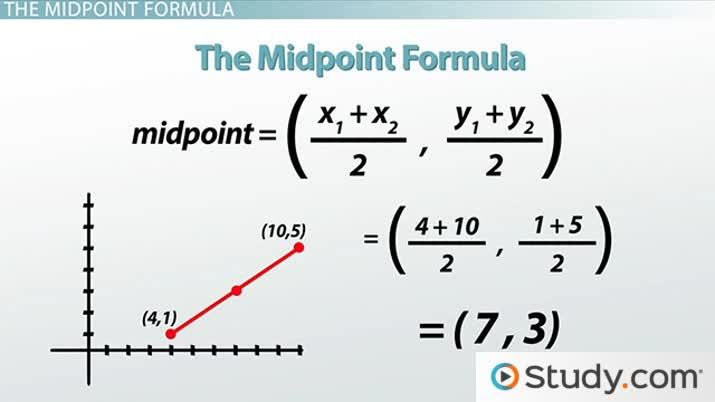

## Number Properties
### what does integers consists of? is 0,1,and -1 integers?
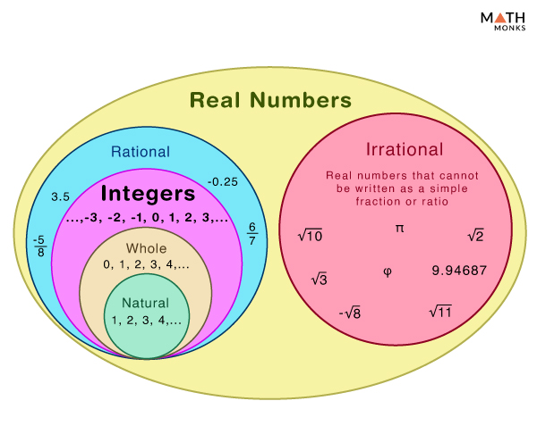
0 is even number

### primes 
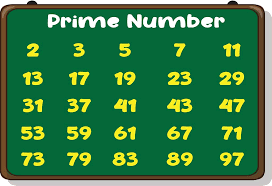

### study the trick of divisible number such as 3, 9 
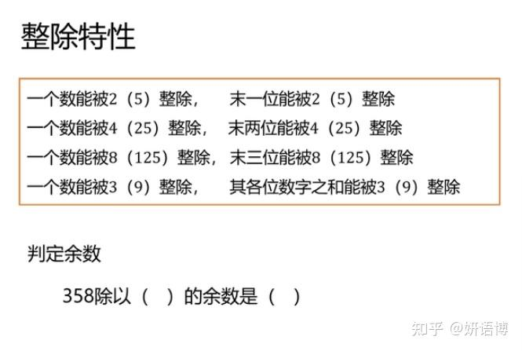

### compound interest AND simple interest 
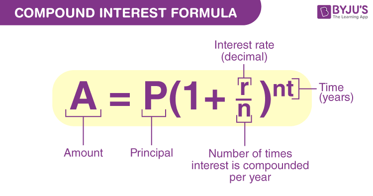
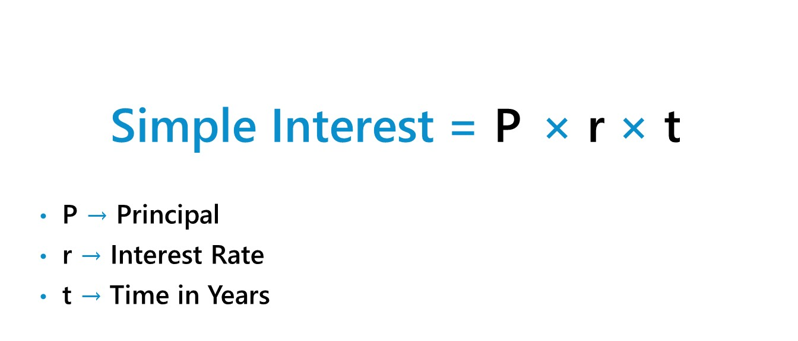

### result of a sqaure root, the answer must be positive
Ex: k^2 = x + 1, since x+1 on the right side is the answer of a squre root.
x + 1 >= 0 or else the solution fails.

### integer and sum problem note:
if 1.25x is the sum of integer sets,  x must be multiple of 4
if 0.09x is the sum of the integer sets, x must be multiple of 100
if 0.15x is the sum of the integer sets, x must be multiple of 20
if 0.075 is the sum of the integer sets, x must be multiple of 40 

### even and odd number properties
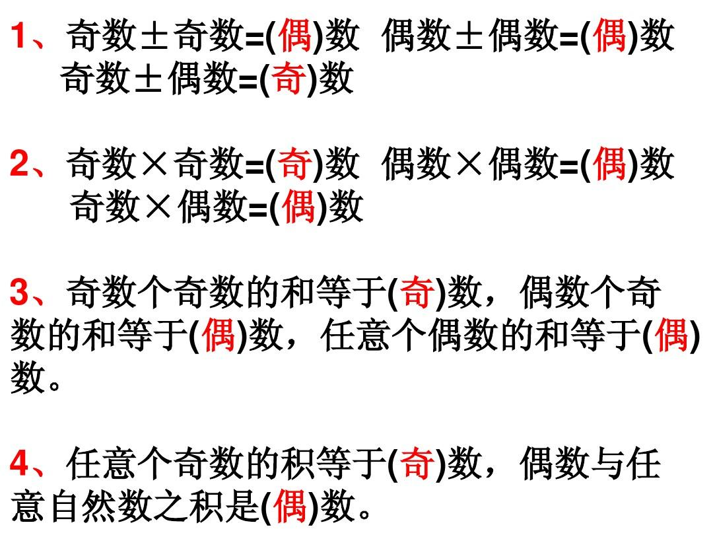
- 奇数 有 奇数个， 和 差 为奇数 
Ex: a+b+c+d+e （a c e are odd） 3 of them are odd 
their sum is odd
- 奇数 有 偶数个， 和 差 为偶数 
Ex:Ex: a+b+c+d+e （b d are odd） 2 of them are odd 
their sum is even
- odd - odd = even
- even - even = even
- even - odd = odd

### product of even and odd numbers
- all numbers r odd, product is odd
- as long as there is 1 or more even, sum is even

### other useful integer properties
- from odd number A to odd number B (including both end)'s the number of odd = ( (b-a)/2 )  + 1
- from even number A to even number B (including both end)'s the number of even = ( (b-a)/2 )  + 1
- the range of n consecutive odd or even integers = 2(n-1)
- from even number L downtown n even number, you would be at G = L+2(n-1)
- from odd number L downtown n odd number, you would be at G = L+2(n-1)
- if questions asks for things about consecutive odd / even numbers:   
- set evens numbers to 2k-2, 2k, 2k+2, 2k+4, ...  
- set odd numbers to 2k-3, 2k-1, 2k+1, 2k+3, ...

### standard deivation of a equation(only multiply and divide matters)

For any equation ax² + bx + c = 0 -  
Sum of the values of x = -b/a  
Product of the values of x = c/a  

### quadratic formula
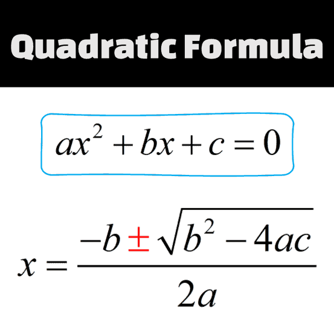

A⽟⽶地杂交种⼦数量17%A，B⽟⽶地杂交种⼦数量11%A
故两个⽟⽶地加起来，杂交种⼦数量17%A+11%·B
占全部种⼦的百分⽐C=(17%A+11%·B)/(A+B)
当A=B，正好平分，那么C⼀定就等于(17%+11%)/2=14%
当A<B，11%的权重更大，那么⼀定偏向11%，故C<14%
当A>B，17%的权重更大，那么⼀定偏向17%，故C>14%
⽽本题，没有给出B和A的关系，故无法比较QA与QB的关系。

### 握手问题
总净握手次数=（总握手人数*每人需要握的次数）/ 2
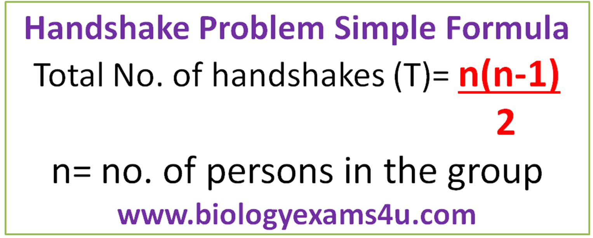

### remainder 
1 / 100 = ans .... 1 remainder always 1 if 1 is smaller than the dividor

