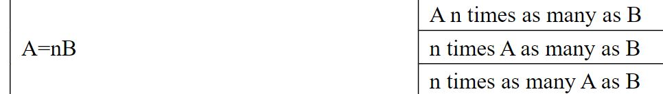
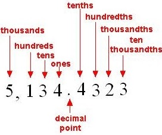
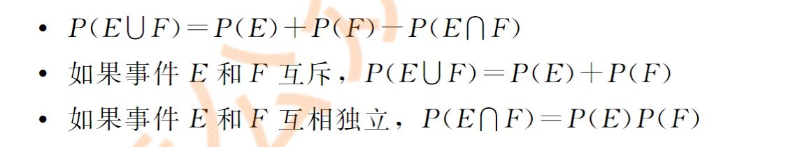
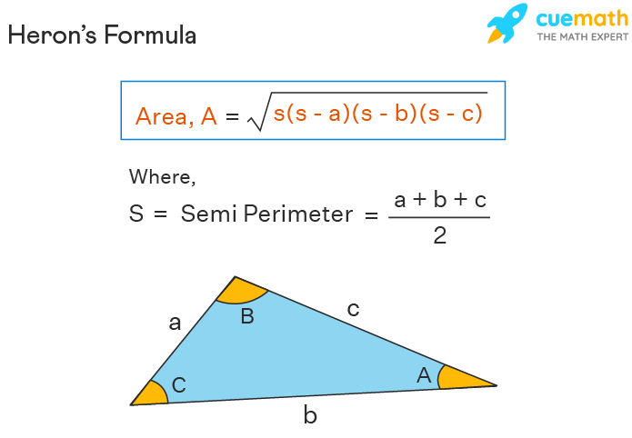
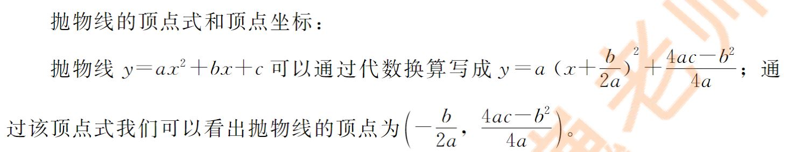
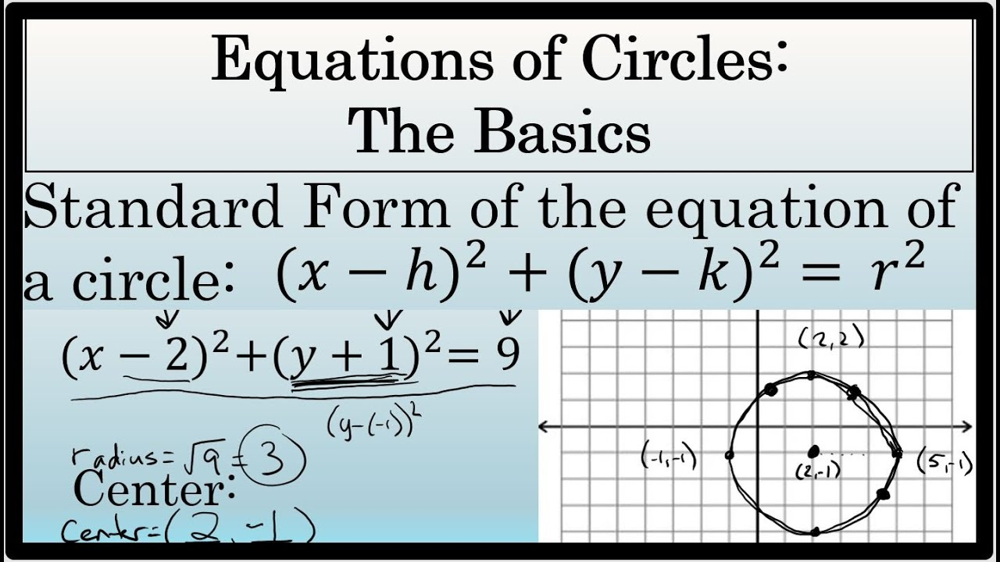
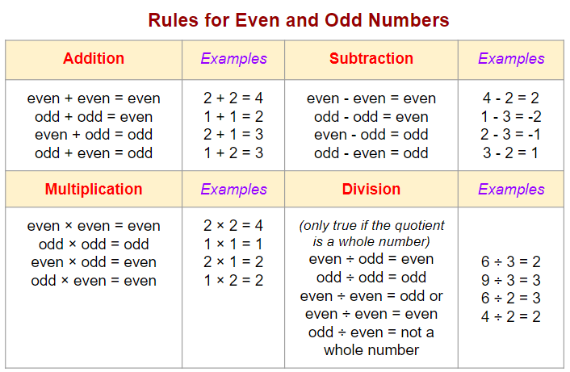

# Key Points to Review

[Stats](#stats)
[Geometry](#geometry)
[xy plane](#xy-plane)
[number properties](#number-properties)

### Need to study more
absolute value problem practice
study inequality
compare Quantity more practice needed
double check the question when u divide the product freqnecy by amount
0 is neither positive or negative
0 is even
negative number division remainder: -17 / 7 = -3 ... 4
a^b * c^b = (a*c)^b
1 centimeter = 10 milimeter
probability?
study SIN COS TAN and traingle short cuts 
均值不等式 
二项式定理
if twice as many employees work at the plant in Mexico as work at the plant in Pakistan Means 2 Pakis = Mexico

- supplemntary angle = sum of angles = 180
- complemntary angle = sum of angles = 90
### Combination 
Ex: 8 pick 4 when order don't matter
8C4 = 8!/(8-4)!4! = 8*7*6*5/4*3*2*1 = 70
- n pick k's result is the same as n pick (n-k)

### Permutation
Ex: 8 pick 4 when order does matter
if repeats are not allowed:
8P4 = 8! / (8-4)! 
if there is repeat
8^4

### Stats 
### Normal Curve

Area between 1 sd = 68 / 34.13% each
Area between 2 sd = 95 / 13.59% each
Area between 3 sd = 99 / 2.14% each

### skewed to the left or right: mean VS median

skew to the right: mean > median
skew to the left: mean < median

### boxplot

## Geometry
### Triangles
### Congruent Triangles
SSS, SAS, ASA, AAS

### Propery of Isosceles, Equilateral

### equilateral triangle area formula

### angle theory
- if the sum of the two smallest side's squre is smller than the third side's squre, triangle would be obtuse triangle. If bigger, then it is a acute triangle.
- radical 3 / 4 * (a^2) 
- a is the side length

### triangle area given each side length

多边形内角和公式=(n-2)*180

- If using constant perimeter, the biggest area of the triangle would be formed using equilateral triangle.

- If there is 2 similar triangle, the ratio between their area is the squred of the ratio of their length.

- the ouside angle is the same as the sum of 2 inner angle located not next to the outisde angle.

三角形：外角=两个内角和
两边之和大于第三边， 两边之差小于第三边。

### Rhombus
rhombus's 4 sides are equal.

study rhombus's area equation 
- given side and hieight, area = side * height
- given d1 and d2 which are directly across inside it, area = 1/2 * a * b
- given side and angles, area = s^2 sin angle

### Trepazoid
- area: 1/2 * (base1 + base2) * h

### circle

- length of arc is calculated by: 
arc length /  perimeter of circle = center angle / 360 

- if there is a right triangle inscribed inside the circle, then one side of the triangle is the diameter of the circle.

### 同圆或等圆中，同弧或等弧所对的圆周角相等

### circular cone equation

### n边形对角线数量公式

### 3-dimentional
- rectangular 3-d model has 6 surfaces and 8 vertex.
- surface area = A = 2 (wl + wh + lh)
- volumn = lwh

cylinder
- volumn = pi  * r^2 * h
- surface area = A = 2 * pi * r^2 + h * pi * 2r

## XY-Plane
### formula for the difference of square  

- (a+b)^2 = a^2 + 2ab + b^2 and (a-b)^2 = a^2 - 2ab+b^2
- (a+b)^3 = a^3 + 3 a^2 b + 3 a b^2 + b^3
- (a-b)^3 = a^3 - 3 a^2 b + 3 a b^2 - b^3
- (a^2 - b^2) = (a-b)(a+b)

### distance formula

### 4 qraduents

### Perpendicular
- if we equations' slope's product = 1
Ex: y= 2x+5 and y= -1/2x + 9
2 * -1/2 = -1, then they are perpendicular

### symmetrical problems
- if point 1 and point 3 are symmetrical with respect to point 2, then
- x2 = (x1 + x3) / 2 
- y2 = (y1 + y3) / 2

- if point 1 and point 2 are symmetrical with respect to y=x, then
- point 2 = (y1, x1)

- if 2 straight lines are symmetrical with respect to y=x, then first pick 2 points of the original equation and from there we would get the 2 corresponding flipped points of the symmetrical equation. Then we can find the slope and the y-intercept of the equation.

### parabola
y=ax^2 + bx + c
- the distance of the parabola opening is the distance between the two root
- if a > 0, the parabola opens upward, vertex is at the minimum point.
- if a < 0, the parabola opens downward, vertex is at the maximum point.

- -b/2a is the line of symeetry

### Circle

### Functions
- f(x)+c shift up c
- f(x)-c shift down c
- f(x+c) move left c
- f(x-c) move right c
- c * f(x): c>1 stretch vertically
- c * f(x): 0 < c < 1 shrunk vertically

### find midpoint of 2 points

## Number Properties
### what does integers consists of? is 0,1,and -1 integers?

0 is even number

### primes 

- 2 is the only prime and even number
- any even numbers bigger than 2 can be the sum of 2 prime numbers

### study the trick of divisible number such as 3, 9 

### compound interest AND simple interest 

### result of a sqaure root, the answer must be positive
Ex: sqrt(k) = x + 1, since x+1 on the right side is the answer of a squre root.
x + 1 >= 0 or else the solution fails.

### integer and sum problem note:
if 1.25x is the sum of integer sets,  x must be multiple of 4
if 0.09x is the sum of the integer sets, x must be multiple of 100
if 0.15x is the sum of the integer sets, x must be multiple of 20
if 0.075x is the sum of the integer sets, x must be multiple of 40 

### even and odd number properties

- 2 consecutive positive integers'product is 2's multple. 
- 3 consecutive positive integers' product is 6's multiple.
- 奇数 有 奇数个， 和 差 为奇数 
Ex: a+b+c+d+e （a c e are odd） 3 of them are odd 
their sum is odd
- 奇数 有 偶数个， 和 差 为偶数 
Ex:Ex: a+b+c+d+e （b d are odd） 2 of them are odd 
their sum is even
- odd - odd = even
- even - even = even
- even - odd = odd

### product of even and odd numbers
- all numbers r odd, product is odd
- as long as there is 1 or more even, sum is even

### Find least common multiple / greatest common divisor:
LCM:
1. separate 2 numbers into their prime factors
2. find all common factors. Only keep the factors that has the highest power, get rid of other common factors with lower powers
3. multiply the left over factors, alltogether

GCD:
1. separate 2 numbers into their prime factors
2. find all the common divisors, take the one with the lowest power.
3. multiply common divisors

Ex: Find LCM and GCD of 64 and 72
64 = 2^6     72 = 2^3 * 3^2
so LCM = 2^6 * 3^2 = 576 
GCD = 2^3 = 8

### the reptition of the unit digit after powers
start from power of 1
- 2's power: 2, 4, 6, 8
- 3's power: 3, 9 ,7, 1
- 4's power: 4, 6
- 6's power: 6
- 7's power: 7, 9, 3, 1
- 8's power: 8, 4, 2, 6
- 9's power: 9, 1

### negative numbers
- they have 1 and only 1 odd numberth root
Ex： 3rd root of -8 = -2

### absolute rules
- | a + b | <= | a | + | b | also known as TRIANGLE INEQUALITY
- | ab | = | a | * | b |
- if a>1, then a^2 > a; if 0<a<1, then a^2 < a

### Percentage
- x percent = x/100

### other useful integer properties
- from odd number A to odd number B (including both end)'s the number of odd = ( (b-a)/2 )  + 1
- from even number A to even number B (including both end)'s the number of even = ( (b-a)/2 )  + 1
- the range of n consecutive odd or even integers = 2(n-1)
- from even number L downtown n even number, you would be at G = L+2(n-1)
- from odd number L downtown n odd number, you would be at G = L+2(n-1)
- if questions asks for things about consecutive odd / even numbers:   
- set evens numbers to 2k-2, 2k, 2k+2, 2k+4, ...  
- set odd numbers to 2k-3, 2k-1, 2k+1, 2k+3, ...

### standard deivation of a equation(only multiply and divide matters)

For any equation ax² + bx + c = 0 -  
Sum of the values of x = -b/a  
Product of the values of x = c/a  

### quadratic formula

A⽟⽶地杂交种⼦数量17%A，B⽟⽶地杂交种⼦数量11%A
故两个⽟⽶地加起来，杂交种⼦数量17%A+11%·B
占全部种⼦的百分⽐C=(17%A+11%·B)/(A+B)
当A=B，正好平分，那么C⼀定就等于(17%+11%)/2=14%
当A<B，11%的权重更大，那么⼀定偏向11%，故C<14%
当A>B，17%的权重更大，那么⼀定偏向17%，故C>14%
⽽本题，没有给出B和A的关系，故无法比较QA与QB的关系。

### 握手问题
总净握手次数=（总握手人数*每人需要握的次数）/ 2

### remainder 
1 / 100 = ans .... 1 remainder always 1 if 1 is smaller than the dividor

