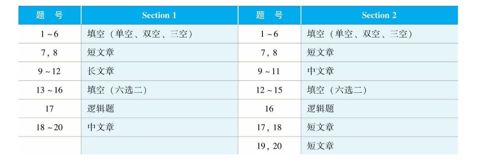
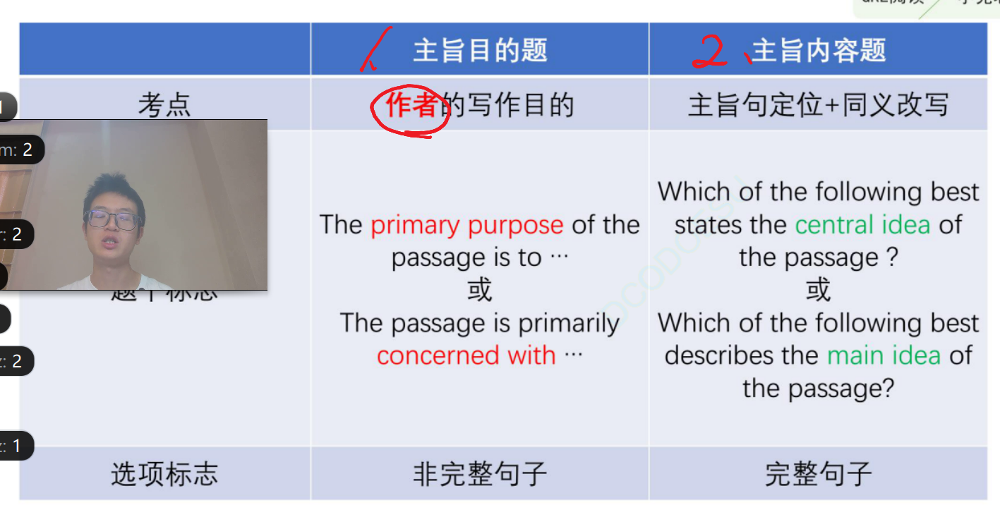
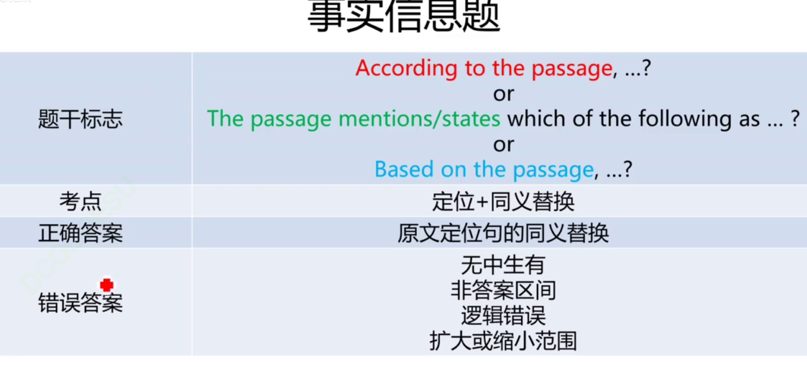
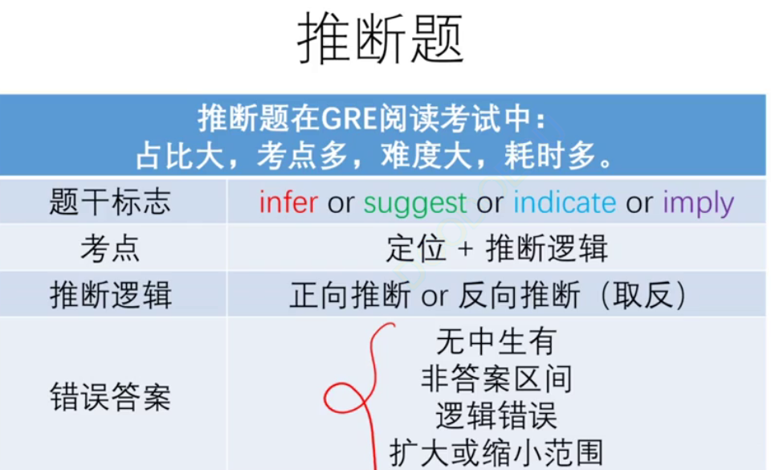
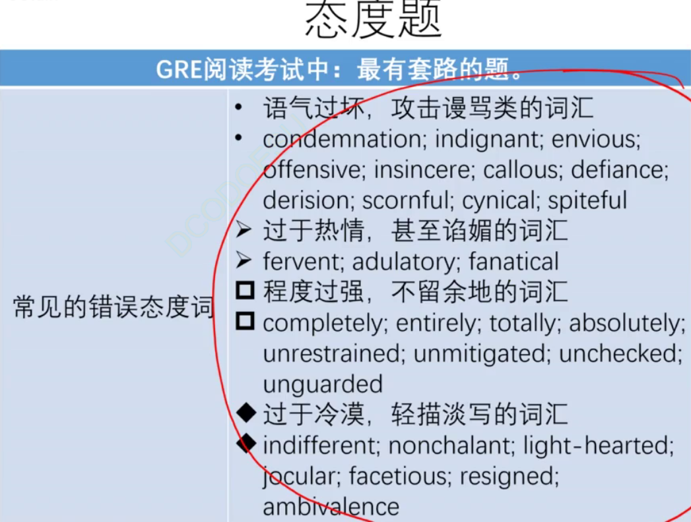

- 张巍GRE 
step 1 读题
step 2 读文章
step 3 排除法

## 主旨题
1.回原文找依据

- 考作者的写作目的
-short passage types
1. 现象解释
2. 问题解决
3. 新旧观点： 2个观点 对立
4. 观点点评： +粉丝 -键盘侠 没有提供新观点或解决方法
5. 说明文

主旨题的三种情况
- 有结构能对应选项   
- 有结构 不能对应选项
- 无结构 没对应

- 看作者 支不支持观点 还是客观描述

主旨题错误特征
1. 立驳颠倒： 看动词 不能方向相反
2. 事实观点颠倒 - 
事实：confirmed theory, universially accepted theory, results/research/study
观点：theory, scientific theory, widely held theory/established theory
3. 以偏概全
- 读主旨， 只读主干

如果文章有2或多段，主旨题考的是 段落关系

- GRE阅读错误选项特征
1. 逻辑错误： 与原文矛盾 / 因果关系
2. 无中生有：有以下比较关系： （大部分是错的选项）
- 同级 （我和你一样好）
- 比较 （我比你好）
- 最高级（我最好）
3. 非答案区间：不在定位区域里面
4. 扩大或缩小范围

## 事实信息题

- 通过原文定位，然后改写，最后通过错误特征排除
- 注意问题问的动词 because 

## 推断题

- 正向推断：基于原文做推断， 不一定要在原文
- 很可能把正确答案当成无中生有
- 推断取反：
1. 对立信息取反： 文中标志词 only
2. 数量取反： 标志词： 数量 很多 / 一些
3. 时间取反： 标志词：时间

做题步骤
1. 读题， 判定题目类型：先找题干标志，再到原文找定位词
2. 根据定位词， 回原文定位置
3. 利用推断逻辑（正或者取反）和排除法做题。

- 如果没有明显取反的特征，就用正向推理
- until 意思是 before 之前

## 定位的三个原则
1. 有人必找人 定位句
2. 如果定位句有指示代词，比如they，得往前找，扩大范围区间
3. 没法定位 先标记最后再做因为费时间

## 同义替换的三种情况
1. 原文原词
2. 传统的同义替换 一一对应
3. 广义取同：原文与选项不矛盾 走投无路之举

- 引号 一定是有 原文原词

## 看到副词或者程度的：
1. laregly， extend 99%都是错的 因为原文没有对程度进行定义
2. 原文： GRE考生很难考到verbal 170
- 选项绝大部分考生通常很难考不到verbal 170

- 选项的指代 和 原文的指代 没有关系
- 如果出现在选项中那代词特指主语

## 句子功能题
- 考句子之间的关系
- 正向
- 反向 a departure from B  
1. 利用高亮句和前一句关系进行排除
- 看动词
- 看内容：没反向词，就是正向。有反向词，不一定取反
- quality 部分同意 部分反驳 90%会是对的
2. 看题目问是与前面的句子还是后面的句子的关系
- mentioned earlier 先别做范围太广了
3. 读关键句 找关键词 和选项对应
- 读高亮句的主干

## 信息目的题
- 标志：primarily to / in order to 
- 汉堡包原则 看前和后的关系

## 多选题
- 阅读中优先级最低的题 建议跳过最后做
- 需要和其他题型进行搭配
- 答案有可能会跨区
- 双定位：用题干 + 选项
- 用选择项定位，有利于排除无中生有

## 微观信息目的题
- 句子内部解决不了 看上下
- 考主语或者宾语
- 找讨论的对象
- 题目终会有一个动词 比如question 那就必须找和question相关的

## 逻辑单题
1. 阅读题干 分清题型
2. 阅读文章 找全要素
3. 根据题型 选择选项 
最常见的 加强 削弱 假设

逻辑单题三要素
1. 前提假设：已知的客观事实
2. 因果推理
3. 结论：主观的观点

找结论的方法
1. 关键词 thus so therefore
2. 可能性 是观点的表述
3. 所有的句子都在为这句服务

逻辑单题的错误选项特征
1. 加量选项 - 可有可无的废话
这种选项多是原文已知细节的重复和补充
如果看到 only 99%是错的
2. 无关选项 - 无中生有
无能换对象 不然可能有类比错误
3. 反向选项

加强 strenghen / support 两因题：踩对方
如果原文有A和B 更支持A 我们可以踩B来加强结论

削弱 weaken
- 取反文章的结论 看哪个选项增强这个取反后的结论

假设题 assume / assumption 
1. 选项取反，能削弱结论就是正确答案
如果结论讨论了2各方面 选项也要对应的讨论2个方面 全面对应
- 注意选项没有换对象

句子作用题
- 有高亮句
- 找前提和结论
1. 读全文 不只是高亮句
2. 不能用他的位置来决定他的作用

填空题
- 就是加强题

归纳
- 题干：support
- 加强题已经给了结论，需要支持他。归纳题没给结论，要我们自己找

解释
- explain
- 需要支持题干中表的逻辑 不一定是文章的结论

## 类比题
- 题干标志：similar to... / closely parallels..?
- 考的是趋势相似
- 趋势比如 上升 下降 数量变化
- 是一种模糊对应 不是原文改写
- 找变化趋势 再找选项里趋势相同的

## 态度题
- 正向态度： 积极肯定
- 负向态度：否定批评
- 客观严谨态度：警告处理事务需要谨慎
- 标志词：assert / best describes the author's attitude
- 答案区间：文章首尾
- quality 常见正确选项
- 常见错误特征有语气过坏，过于热情，程度过强，过于冷漠

when countering a change in tone such as YET, be ready to read a bunch of supplying evidence for the proposes theory.

## 否定事实信息题
- 2种 except NOT
- 找定位词 回文定位
- except型中正确选项的特征：
1. 原文中未出现 -- 无中生有
2. 和原文的信息相矛盾 -- 逻辑错误
- NOT型中正确选项的特征：
1. 直接把NOT加入选项判定是否正确

## 长文章
- 一般8分钟做完 放最后做
- 9-12 mark 最后做

长主旨题
- 首段必读 剩下读段落首句

- 注意看题目问的是不是作者的目的 有人必找人

should know which evidence is supporting which thesis.

look for keywords in the passage, and find the evidence in front

you dont have to pick 2 correct answers for multi select

Whenever finish reading a paragraph, ask yourself
1. main subject?
2. what's the logic
3. what's author's attitude towards it. Does he support, object, or further extend the topic?

read questions carefully and find out whoes view is it

watch out for key words in the question such as EXCEPT! Don't forget what the question is asking when reading all the choices.

in certain options, they might have slight difference in wording that changes the sentence logic 180 degrees. 
Ex: water level rises hurt the beaver home. In passage, water level fell would hurt beaver home.
### KMF 6/6/2023 notes

when reading, mark the type of the sentence.
展开
事实
引出

we can doodle to smmarize the key ideas.

Functional questions keywords:
in order to
serve to 
function

for attemps, go look for the shared properties on the front of the material. NOT AFTER THE material.

